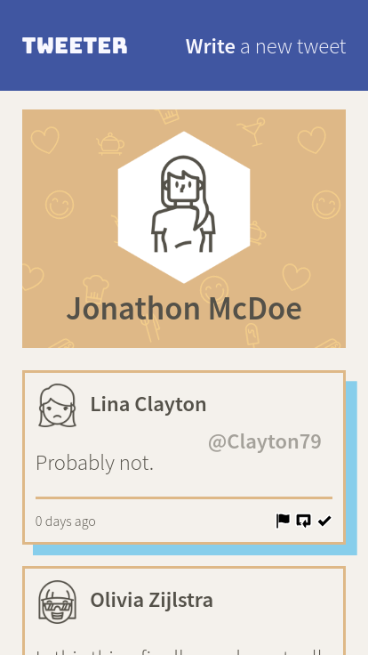

# Tweeter Project

Tweeter is a simple Twitter clone.  It is intended for demonstration of responsive, single-page web app design that is suitable for use on any device.  It does not include any user account management or permanent storage of data.

Tweeter is not suitable for production use and is only for demonstration and educational purposes.

## **Screenshots**

Tweeter is beautiful:


Large screen, initial display, composing new tweet


Large screen, error display


Small screen, hovering over a tweet


Small screen, scrolled down


Almost usable on a Nokia 8110

## **Getting Started**

### **Setup**

Install Node.js from your [package manager](https://nodejs.org/en/download/package-manager/), or [download](https://nodejs.org/en/download/) binaries (for fun) or source code (for maximum fun).

Then execute the following to set up Tweeter:

```
git clone https://github.com/d0ugr/tweeter
cd tweeter
npm install
```

### **Run**

To start on port 8080:

```
npm start
```

Then open http://localhost:8080 in your browser.

## **Development**

### **Directory Structure**

The project files are arranged as follows:

```
./                     Main project directory Tweeter was cloned into
./public               EJS HTML
./public/images        Static images used on the site
./public/scripts       Client-side JavaScript
./public/styles/sass   SASS style sheets
./public/styles/css    Precompiled CSS (auto-generated - do not edit)
./public/vendor        Client-side JavaScript libraries
./server               Main JavaScript
./server/data-files    Sample data
./server/lib           Helper modules
./server/routes        Express routes
./docs                 Screenshots
```

### **Dependencies**

Tweeter requires [Node.js](https://nodejs.org) and the following [NPM](https://www.npmjs.com/) packages are used:

- [express](https://www.npmjs.com/package/express)
- [body-parser](https://www.npmjs.com/package/body-parser)
- [chance](https://www.npmjs.com/package/chance)
- [md5](https://www.npmjs.com/package/md5)

### **Development Dependencies**

The following NPM packages are used for development:

- [nodemon](https://www.npmjs.com/package/nodemon)
- [node-sass](https://www.npmjs.com/package/node-sass)

### **Run**

While working on Tweeter it is preferable to use nodemon to automatically restart the server when files change:

```
npm run local
```

### **Testing**

There are no unit tests at the time.
